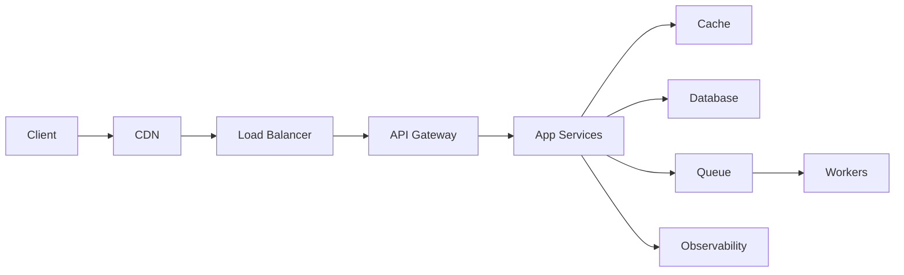

# System Design & Patterns Interview Guide

An **interview-prep-depth** curriculum for system design, design patterns, and SOLID principles. Every concept is grounded in real-world examples, tradeoffs, and interview-ready phrases.

**Estimated study time:** ~20 hours over 2-3 weeks.

Every module follows the same template: **TL;DR → Concept (with daily-life analogy) → How It Really Works → Why/When/Trade-offs → Worked Scenario → Gotchas → Interview Q&A → Further Reading**.

---

## Prerequisites

You should be comfortable with:

- Basic distributed-systems vocabulary (nodes, replication, leader/follower).
- HTTP APIs and REST conventions.
- Reading and writing SQL queries.
- Object-oriented programming basics.

You do **not** need a running cluster or cloud account to study this material.

---

## The Mental Model in One Line

> Scale **reads** with cache and CDN, scale **writes** with queues and sharding, **protect** with gateway and rate limits, and **observe** everything with logs, metrics, and traces.

---

## Curriculum (16 modules)

### Foundation

| # | Module | Topics |
|---|--------|--------|
| 0 | [Interview Approach](modules/00-interview-approach.md) | Requirements, scale, APIs, data model, architecture flow |
| 1 | [Load Balancer](modules/01-load-balancer.md) | L4 vs L7, algorithms, health checks, sticky sessions |
| 2 | [API Gateway](modules/02-api-gateway.md) | Routing, aggregation, auth at edge, versioning |
| 3 | [Caching](modules/03-caching.md) | Cache-aside, write-through, TTL, stampede, hot keys |
| 4 | [Rate Limiting](modules/04-rate-limiting.md) | Token bucket, distributed limiter, 429 responses |

### Platform

| # | Module | Topics |
|---|--------|--------|
| 5 | [Circuit Breaker](modules/05-circuit-breaker.md) | States, fallbacks, vs retries |
| 6 | [Message Queues](modules/06-message-queues.md) | Queue vs stream, delivery semantics, idempotency, DLQ |
| 7 | [Database Scaling](modules/07-database-scaling.md) | Indexes, replicas, partitioning, sharding |
| 8 | [Consistency & Availability](modules/08-consistency-availability.md) | CAP, strong vs eventual, quorum, read-your-writes |

### Production & Design

| # | Module | Topics |
|---|--------|--------|
| 9 | [Observability](modules/09-observability.md) | Logs, metrics, traces, SLI/SLO/SLA |
| 10 | [Security](modules/10-security.md) | Auth, authorization, encryption, secrets |
| 11 | [System Design Patterns](modules/11-common-system-design-patterns.md) | Backpressure, retries, bulkheads, idempotency |
| 12 | [Creational Patterns](modules/12-creational-patterns.md) | Singleton, Factory, Builder, Prototype |
| 13 | [Structural Patterns](modules/13-structural-patterns.md) | Adapter, Decorator, Facade, Proxy, Composite |
| 14 | [Behavioral Patterns](modules/14-behavioral-patterns.md) | Strategy, Observer, Command, State, Chain |
| 15 | [SOLID Principles](modules/15-solid-principles.md) | SRP, OCP, LSP, ISP, DIP with examples |

---

## Concept Library

A granular, per-topic reference lives in [`overview-concepts/`](overview-concepts/). Each folder has a `README.md` index and short focused files. Use it when you want a single concept explained quickly rather than a full module.

| Folder | Focus |
|--------|-------|
| [00-interview-fundamentals](overview-concepts/00-interview-fundamentals/) | Requirements, scale, APIs, data modeling |
| [01-load-balancing](overview-concepts/01-load-balancing/) | L4/L7, algorithms, health checks, sticky sessions |
| [02-api-gateway](overview-concepts/02-api-gateway/) | Routing, aggregation, auth, versioning |
| [03-caching](overview-concepts/03-caching/) | Cache patterns, TTL, stampede, hot keys |
| [04-rate-limiting](overview-concepts/04-rate-limiting/) | Algorithms, distributed limiter |
| [05-circuit-breaker](overview-concepts/05-circuit-breaker/) | States, fallbacks, vs retries |
| [06-message-queues](overview-concepts/06-message-queues/) | Queue vs stream, delivery, DLQ |
| [07-database-scaling](overview-concepts/07-database-scaling/) | Indexes, replicas, sharding |
| [08-consistency-availability](overview-concepts/08-consistency-availability/) | CAP, consistency models, quorum |
| [09-observability](overview-concepts/09-observability/) | Logs, metrics, traces, SLO |
| [10-security](overview-concepts/10-security/) | Auth, encryption, secrets |
| [11-system-design-patterns](overview-concepts/11-system-design-patterns/) | Backpressure, bulkheads, idempotency |
| [12-design-patterns](overview-concepts/12-design-patterns/) | All GoF patterns, one per file |
| [13-solid](overview-concepts/13-solid/) | Each SOLID principle |
| [14-interview](overview-concepts/14-interview/) | Opening flow, phrases, red flags |

---

## Cheatsheets

- [Interview cheatsheet](cheatsheets/interview-cheatsheet.md) — opening flow, when-to-use-what, strong phrases.
- [Common follow-up questions](cheatsheets/common-follow-up-questions.md) — Q&A by topic.
- [Mock system design prompts](cheatsheets/mock-system-design-prompts.md) — 8 practice prompts with scoring checklist.

---

## Suggested Schedule

| Week | Modules | Focus | Hours |
|------|---------|-------|-------|
| 1 | 0-4 | Interview approach, LB, gateway, cache, rate limiting | ~6 |
| 2 | 5-8 | Circuit breaker, queues, DB scaling, consistency | ~6 |
| 3 | 9-11 | Observability, security, system design patterns | ~4 |
| 4 | 12-15 + cheatsheets | Design patterns, SOLID, mock prompts, review | ~4 |

### 7-Day Crash Course

**Day 1:** Interview approach, requirements, APIs, capacity thinking.

**Day 2:** Load balancing, API gateways, rate limiting, circuit breakers.

**Day 3:** Caching, database scaling, consistency and availability.

**Day 4:** Queues, observability, security.

**Day 5:** Creational and structural design patterns.

**Day 6:** Behavioral patterns and SOLID principles.

**Day 7:** Mock prompts, follow-up questions, and cheatsheet revision.

---

## How Each Module Is Structured

1. **TL;DR** — the mental model in a few lines.
2. **Concept** — plain-language explanation with a daily-life analogy.
3. **How It Really Works** — internals with diagrams.
4. **Why / When / Trade-offs** — senior decision-making.
5. **Worked Scenario** — a realistic situation end-to-end.
6. **Gotchas & Failure Modes** — what bites people.
7. **Interview Q&A** — sharp answers and follow-ups.
8. **Further Reading** — links to concept library and cheatsheets.

---

## Quick Interview Checklist

Before answering, always know:

- Is the system read-heavy, write-heavy, or balanced?
- What consistency does the user experience require?
- What is the failure mode if a dependency is down?
- Where can the system become hot: user, key, shard, service, queue, or region?
- What can be cached safely?
- Which operations must be idempotent?
- What metrics prove the design is working?
